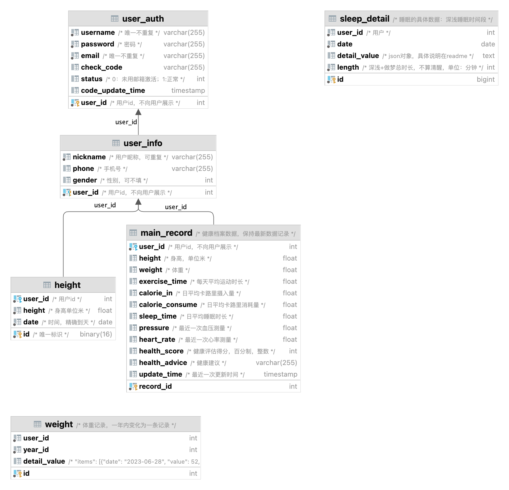

# README

数据库名：health

在src\main\resources中的`application.properties`修改数据库信息


## 数据库具体字段



---

## 返回值

* Msg
  * Msg.status：状态值（int）
  * Msg.msg：信息（string）
  * Msg.data：传递的json数据

**以下没有特殊说明，data为null**

## 服务拆分

### 1. 用户管理服务⭐ 

table：user，userAuth

#### 1.1 **登录、注册**

- [x] **"/register/check_name"：**

  检查用户名是否重复 

  ```json
  @RequestBody：  {username: 'xxx'}
  ```

- [x] **"/register/send_email_code"**

  注册第一步：发送邮箱验证码

  ```json
  @RequestBody: 
  { 
    	"username": "test",
      	"password":"test",
  	"email":"test@sjtu.edu.cn"
  }
  ```


​	**TODO**：邮箱发送信息（**目前默认验证码都是123456**）


- [x] **"/register"**

  注册第二步：验证邮箱验证码
  
  ```json
  @RequestBody：
    {
      "username": "test",
        "check_code":"123456"
  }
  ```
  
  

#### 1.2 用户资料的增删改

### 2. 健康数据服务⭐⭐⭐

1. > table：latest_record、weight、pressure、sleep.....

2. **健康档案**服务：
  
   1. 个人健康档案的**创建、更新、查询**
   
2.   接口：`ModifyRecord` , `GetRecord`, `GetRecordByDate`
  
   3. **档案健康分析**
      1.    接口：`GetHealthCondition`,`GetHealthAdvice`
   
3. **体重**记录
  
   - [x] **"/weight"**

     获取一段时间内的体重
   
     weight为jsonArray，其中一条detailValue记录一年的，每一天的在items中。
   
     ```json
     @RequestBody
     {
         "user_id": 1,
         "start_date":"2022-06-10",
         "end_date":"2023-06-29"
     }
     
     @Return
     {
         "status": 1,
         "msg": "成功！",
         "data": {
             "weight": [
                 {
                     "detailValue": {
                         "items": [
                             {
                                 "date": "2023-06-10",
                                 "value": 59.1
                             }
                         ]
                     },
                     "id": 1,
                     "userId": 1,
                     "yearId": 2023
                 }
             ]
         }
     }
     ```
   
   - [x] **"/add_weight"**
   
     增加体重记录，一天内重复数据**覆盖**
   
     ``` json
     @RequestBody
     {
         "user_id": 1,
         "date":"2023-06-10",
         "weight":59.1
     }
     @Return
     {
         "status": 1,
         "msg": "成功！",
         "data": {
             "detailValue": "{\"items\":[{\"date\":\"2023-06-10\",\"value\":59.1},{\"date\":\"2023-07-10\",\"value\":56}]}",
             "id": 1,
             "userId": 1,
             "yearId": 2023
         }
     }
     ```
     
   
   
   
5. 身高记录：

   - [x] **"/height"**

     获取某人某天身高

     ```java
     @RequestBody
     {
         "user_id": 1,
         "date":"2023-07-10",
     }
     @Return
     {
         "status": 1,
         "msg": "成功！",
         "data": {
             "date": "2023-07-10",
             "height": 1.78,
             "userId": 1
         }
     }

   - [x] **"/user_height"**

     获取某人所有身高记录

     ```java
     @RequestBody
     {
         "user_id": 1,
     }
     @Return
     {
         "status": 1,
         "msg": "成功！",
         "data": {
             "heights": [
                 {
                     "date": "2022-07-08",
                     "height": 1.72,
                     "userId": 1
                 },
                 {
                     "date": "2023-07-08",
                     "height": 1.78,
                     "userId": 1
                 },
                 {
                     "date": "2023-07-10",
                     "height": 1.78,
                     "userId": 1
                 }
             ]
         }
     }
     ```

   - [x] **"/add_height"**

     增加体重：同日覆盖

     ```java
     @RequestBody
     {
         "user_id": 1,
         "date":"2023-07-10",
         "height":1.79
     }
     @Return
     {
         "status": 1,
         "msg": "添加成功",
         "data": {
             "date": "2023-07-10",
             "height": 1.79,
             "userId": 1
         }
     }
     ```

     

4. **饮食记录**服务：

   1. **记录饮食**情况（输入饮食种类），后端计算卡路里摄入量
   2.   接口：`AddMeal`

   3. **饮食情况分析**，用户查询饮食、卡路里摄入，健康建议，推荐食谱
      1.    接口：`GetMeal`,`GetCalorieIn`,`GetRecipe`,`GetRecipeAdvice`

5. **运动记录**服务：
   1. **记录运动**情况（输入类型），后端计算卡路里消耗量
      1.    接口：`AddSport`s
   2. **运动情况分析**，用户查询运动、卡路里消耗，健康建议
      1.    接口：`GetSports`,`GetCalorieOut`,`GetSportsAdvice`

6. **睡眠记录**服务：

   - [x] **"/day_sleep"**

     ​	当天睡眠详细数据

     ​	bedtime位于：20：00 - 8：00的算作当天（20：00那天）
     
     ```json
     @RequestBody： 
     {
         "user_id": 1,
         "start_date":"2023-05-28",
         "end_date":"2023-06-29"
     }
         
     @Return
     {
       "status": 1,
       "msg": "成功！",
       "data": {
         "sleep_detail": [
           {
             "date": "2023-06-22",
             "detailValue": {
               "awake_count": 0,
               "sleep_awake_duration": 0,
               "bedtime": 1687365360,
               "sleep_deep_duration": 88,
               "sleep_light_duration": 335,
               "sleep_rem_duration": 88,
               "duration": 511,
               "items": [
                 {
                   "end_time": 1687366140,
                   "state": 3,
                   "start_time": 1687365360
                 },
                 /* ... */
               ],
               "date_time": 1687392000,
               "timezone": 32,
               "wake_up_time": 1687396020
             },
             "id": 1,
             "length": 712,
             "userId": 1
           },
           {
             "date": "2023-06-22",
             /* ... */
           }
         ]
       }
     }
     ```

   

   1. **记录睡眠**情况：从手环、手机获取，手动输入
   2. 接口：`AddSleep`
   3. **睡眠分析** ：查询睡眠、分析睡眠，健康建议
   4. 接口：`GetSleepByDate`,`GetSleepAdvice`

7. **数据分析**服务：所有的分析计算工作放在这里，别处的分析服务只是把数据发个这个接口
   1. **特定类别数据**分析：供其他微服务调用，获取数据+数据类型，返回分析建议。推荐行为。
   2.   接口：`GetAdvice`,`GetRecommend`
   
   - [x] **"/bmi"**
   
     分析BMI
   
     ```java
     @RequestBody： 
     {
         "user_id": 1,
     }
     @Return
     {
         "status": 1,
         "msg": "成功！",
         "data": {
             "bmi": 32.488628979857054,
             "analysis": "肥胖",
             "advice": "您的体重属于肥胖范畴，建议您采取积极的饮食和运动计划，减少高热量食物的摄入，增加有氧运动和力量训练。此外，定期监测血压、血脂和血糖等指标，以降低肥胖相关的健康风险。"
         }
     }
     ```
   
     

### 3. 目标管理服务⭐⭐

1. **设置健康目标**
2.  接口：`SetGoal`

3. **跟踪健康目标的服务：修改完成情况、查询完成情况、统计分析**
4.  接口：`AddImplement` , `GetImplement` ,`AnalyseGoals` 

5. **目标提醒**服务：
6.  TODO：这里是后端主动通知前端吗？用websocket

## 数据库设计

1. 用户管理服务：
   1. 表名：user
      - 字段：user_id, nickname, phone, gender, ....
   2. 表名：user_auth
      - 字段：user_id, username, password, email 【username，email不重复？】....
2. 健康档案服务：每个类别只保留最新记录时间
   1. 表名：health_records
      - 字段：id, user_id, update_date, pressure, height, weight, ave_sleep ....
3. 饮食记录服务：
   1. 表名：diet_records
      - 字段：id, user_id, meal_type【数组？】, meal_time, calories, record_date
4. 运动记录服务：
   1. 表名：exercise_records
      - 字段：id, user_id, exercise_type, duration, calories_burned, record_date
5. 睡眠记录服务：
   1. 表名：sleep_records
      - 字段：id, user_id, sleep_time, deep_sleep, shallow_sleep, dream, record_date
6. 目标管理服务：
   1. 表名：goals
      - 字段：id, user_id, goal_type, goal_description, target_value, start_date, end_date, implement_degree

## 技术

1. MySql关系型数据库
2. WebSocket双向通信
3. AI推荐
4. 登录邮箱验证（可选）
